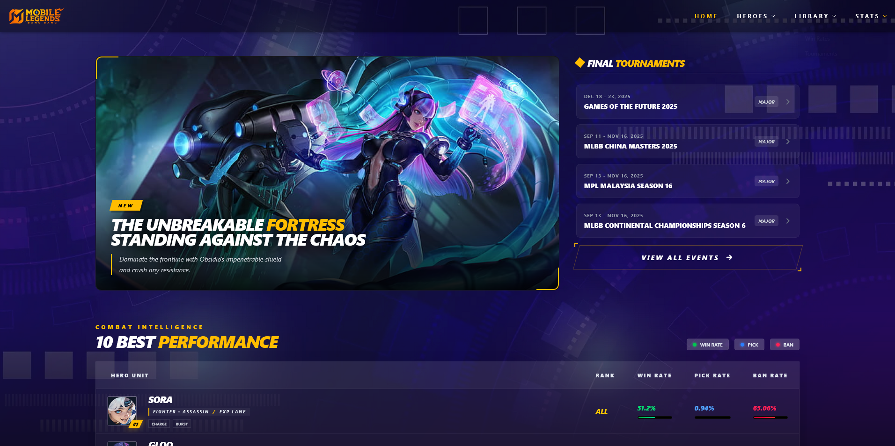

 
# MLBB Database API

MLBB Database API adalah RESTful API berbasis **Node.js + Express** untuk menyediakan data Mobile Legends seperti hero, item, emblem, patch, team, player, match, tournament, dan statistik kompetitif.

---

## 🚀 Features

- Heroes & Hero Details
- Items & Item Details
- Emblems
- Hero Tiers
- Tournament Data
- Hero Statistics
- - More

---

## 📦 Installation

```bash
git clone https://github.com/fitri-hy/mlbb-database.git
cd mlbb-database
npm install
````

---

## ▶️ Running the App

### Development

```bash
npm run dev
```

### Production

```bash
npm start
```

---

## 🌐 API Endpoints

### Heroes

* `GET /api/heroes`
* `GET /api/heroes/:name`

### Items

* `GET /api/item`
* `GET /api/item/:name`

### Emblems

* `GET /api/emblem`

### Game Mode

* `GET /api/game-mode`

### Land of Dawn

* `GET /api/land-of-dawn`

### Stats

* `GET /api/stats`
* `GET /api/tier`

### Team

* `GET /api/team`
* `GET /api/team/:team`

### Player

* `GET /api/player`
* `GET /api/player/:player`

### Patch

* `GET /api/patch`

### Tournaments

* `GET /api/tournaments`

### Matches

* `GET /api/matches`

---

## 📁 Project Structure

```
controllers/
routes/
app.js
package.json
```

---

## 📌 Notes

* API dirancang untuk kebutuhan data Mobile Legends secara terstruktur.
* Status match mendukung: `upcoming`, `live`, `completed`.
* Data diperbarui secara dinamis saat endpoint dipanggil.
